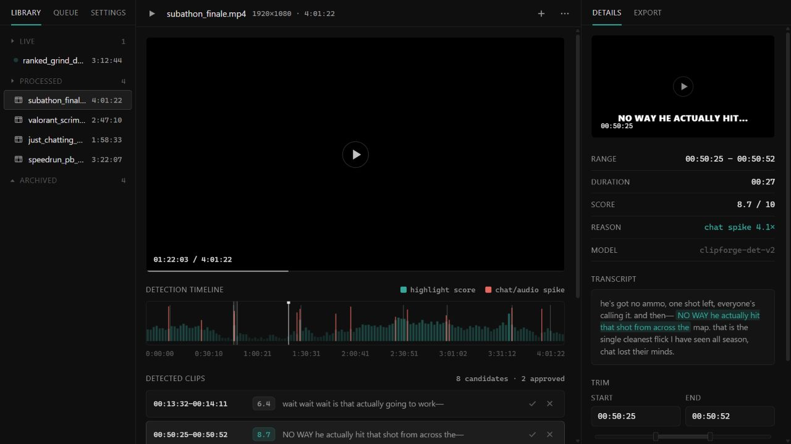

# ClipForge Pipeline

> A full-stack highlight discovery pipeline for YouTube and Twitch VODs—built to find the moments worth editing without downloading the full video.




## Overview

This version of ClipForge expands the desktop prototype into a real ingestion and analysis service. A YouTube or Twitch URL moves through metadata collection, chat and replay analysis, audio peak detection, signal fusion, and targeted transcription. Only lightweight metadata and audio are processed; the full video is never downloaded.

## Pipeline

```text
URL → metadata → chat / replay signals → audio envelope → signal fusion
    → candidate windows → targeted transcription → editor review
```

- **Metadata:** `yt-dlp` retrieves title, duration, uploader, formats, and replay heatmaps.
- **Audience signals:** chat density, replay peaks, and timestamped comment clusters reveal shared reactions.
- **Audio signals:** FFmpeg streams audio-only media into a rolling RMS loudness analysis.
- **Fusion:** nearby candidates merge, with a score bonus when independent signals agree.
- **Transcription:** `faster-whisper` transcribes only the selected candidate windows on CPU.
- **API:** FastAPI exposes asynchronous ingest jobs, progress, timelines, candidates, and health state.

## Tech stack

| Layer | Technology |
| --- | --- |
| Desktop UI | Tauri 2, vanilla JavaScript, HTML, CSS |
| Service | Python 3.11, FastAPI, Uvicorn |
| Media | yt-dlp, FFmpeg via `imageio-ffmpeg` |
| Speech | faster-whisper, CPU int8 |
| Sources | YouTube and Twitch public metadata/chat endpoints |

## Run locally

Create the backend environment from the repository root:

```powershell
python -m venv backend\.venv
backend\.venv\Scripts\pip install -r backend\requirements.txt
```

Start the API:

```powershell
cd backend
.venv\Scripts\python -m uvicorn server:app --port 8971 --host 127.0.0.1
```

In a second terminal, serve the frontend:

```bash
npx serve src --listen 4173
```

The UI automatically connects to the local API and stays in demo mode when the service is unavailable. Set `CLIPFORGE_LIMIT=1200` to cap processing during quick tests.

See [`backend/README.md`](backend/README.md) for the endpoint contract, detection thresholds, and platform-specific behavior.

## Video walkthrough

> 🎬 **Coming soon** — reserved for an end-to-end VOD ingestion and review demo.
